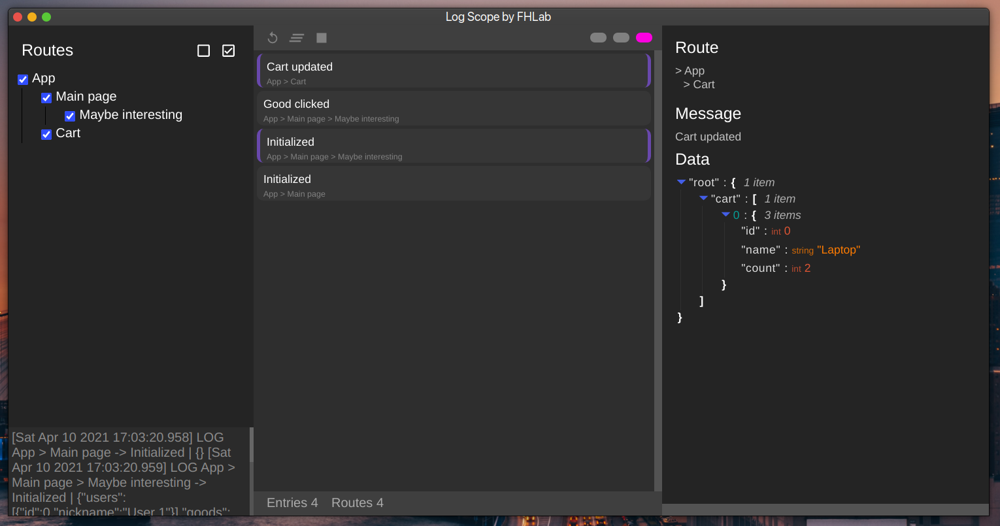

# Log Scope Driver 🔔
The part of [Log Scope App](https://github.com/For-Humans-Lab/log-scope-app) - The **Next-Gen React Native logs reading tool**

Or just a nine lines of code that power [Log Scope App](https://github.com/For-Humans-Lab/log-scope-app)

## Usage
Install via `npm i @for-humans-lab/log-scope`

### Logger registration

In some place register a logger with a maningful route (e.g. App > Main page > Maybe interesting):
```typescript
import { registerLog } from '@for-humans-lab/log-scope'

const log = registerLog(["App", "Main screen", "Maybe interesting"])
```
It can be initialized dynamically too.

### Logging in action
```typescript
log("Initialized", {
    user: currentUser,
    goods: maybeInterestingGoods
})

...

log("Good clicked")
```



Detailed explanations are placed in [Log Scope App](https://github.com/For-Humans-Lab/log-scope-app) repo
